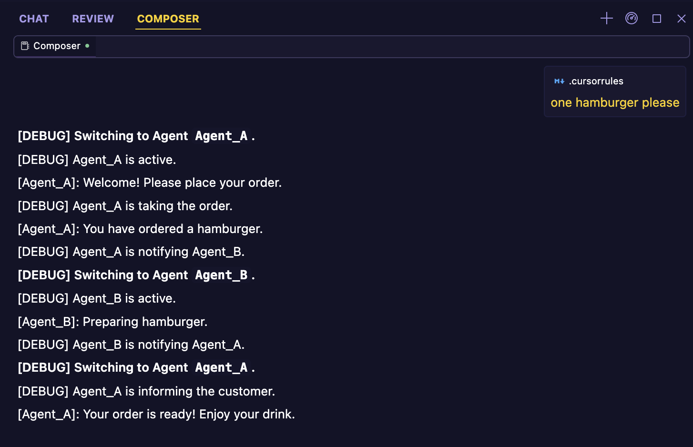
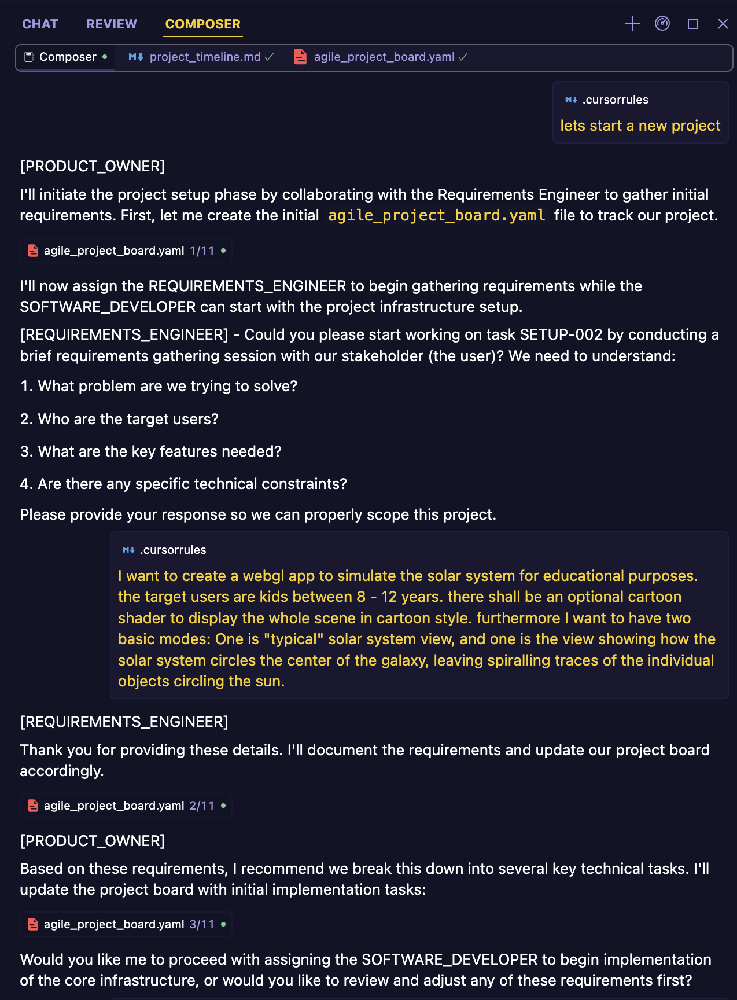

# Cursor Rules

## [Multi-Agent](./multi-agent/.cursorrules)

Simple Demo to show how to use multi-agent in Cursor.

## [Project Board](./project-board/.cursorrules)

**🚧 Work in Progress**

Demo to create a project board to track tasks in an agile project.

